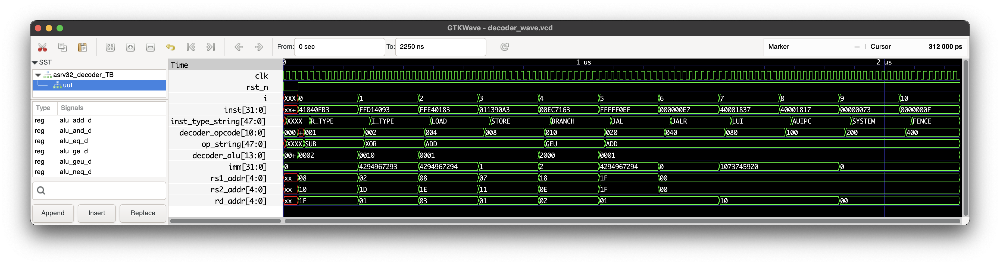

# ASRV32 Decoder Test Bench

This section provides an example of running the ASRV32 decoder test bench and the corresponding output.

## Running the Test Bench

To run the test bench, use the following command:

```sh
iverilog -o asrv32_decoder_TB.out -I rtl -s asrv32_decoder_TB test/Decoder_TB/asrv32_decoder_TB.v rtl/asrv32_decoder.v
vvp asrv32_decoder_TB.out
```

## Expected Output

```plaintext
ASRV32 git:(main) vvp asrv32_decoder_TB.out                                                                         
VCD info: dumpfile decoder_wave.vcd opened for output.

Start Decoding Instructions......

TEST:           0
INST: 0100000_10000_01000_000_11111_0110011
inst_type=R_TYPE
op=   SUB
rs1_addr=01000
rs2_addr=10000
rd_addr=11111
imm=00000000_00000000_00000000_00000000=0

TEST:           1
INST: 1111111_11101_00010_100_00001_0010011
inst_type=I_TYPE
op=   XOR
rs1_addr=00010
rs2_addr=11101
rd_addr=00001
imm=11111111_11111111_11111111_11111101=-3

TEST:           2
INST: 1111111_11110_01000_000_00011_0000011
inst_type=  LOAD
op=   ADD
rs1_addr=01000
rs2_addr=11110
rd_addr=00011
imm=11111111_11111111_11111111_11111110=-2

TEST:           3
INST: 0000000_10001_00111_001_00001_0100011
inst_type= STORE
op=   ADD
rs1_addr=00111
rs2_addr=10001
rd_addr=00001
imm=00000000_00000000_00000000_00000001=1

TEST:           4
INST: 0000000_01110_11000_111_00010_1100011
inst_type=BRANCH
op=   GEU
rs1_addr=11000
rs2_addr=01110
rd_addr=00010
imm=00000000_00000000_00000000_00000010=2

TEST:           5
INST: 1111111_11111_11111_111_00001_1101111
inst_type=   JAL
op=   ADD
rs1_addr=11111
rs2_addr=11111
rd_addr=00001
imm=11111111_11111111_11111111_11111110=-2

TEST:           6
INST: 0000000_00000_00000_000_00001_1100111
inst_type=  JALR
op=   ADD
rs1_addr=00000
rs2_addr=00000
rd_addr=00001
imm=00000000_00000000_00000000_00000000=0

TEST:           7
INST: 0100000_00000_00000_001_10000_0110111
inst_type=   LUI
op=   ADD
rs1_addr=00000
rs2_addr=00000
rd_addr=10000
imm=01000000_00000000_00010000_00000000=1073745920

TEST:           8
INST: 0100000_00000_00000_001_10000_0010111
inst_type= AUIPC
op=   ADD
rs1_addr=00000
rs2_addr=00000
rd_addr=10000
imm=01000000_00000000_00010000_00000000=1073745920

TEST:           9
INST: 0000000_00000_00000_000_00000_1110011
inst_type=SYSTEM
op=   ADD
rs1_addr=00000
rs2_addr=00000
rd_addr=00000
imm=00000000_00000000_00000000_00000000=0

TEST:          10
INST: 0000000_00000_00000_000_00000_0001111
inst_type= FENCE
op=   ADD
rs1_addr=00000
rs2_addr=00000
rd_addr=00000
imm=00000000_00000000_00000000_00000000=0


All Instructions Decoded......
test/asrv32_decoder_TB.v:117: $stop called at 2250000 (1ps)
** VVP Stop(0) **
** Flushing output streams.
** Current simulation time is 2250000 ticks.
```

## GTKWave Simulation Output

To run the simulation, use the following command:

```sh
gtkwave decoder_wave.vcd
```
## Expected Simulation Output



This output demonstrates the successful decoding of various instructions by the ASRV32 decoder.