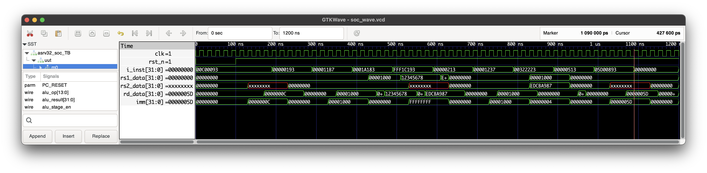

# ASRV32 SoC Test Bench

This section provides an example of running the ASRV32 SoC test bench and the corresponding output.

## Running the Test Bench

To run the test bench, use the following command:

```sh
iverilog -o asrv32_soc_TB.out -I rtl -s asrv32_soc_TB rtl/*.v test/SoC_TB/asrv32_soc_TB.v
vvp asrv32_soc_TB.out
```

## Expected Output (With Warnings)

```plaintext
ASRV32 git:(main) vvp asrv32_soc_TB.out                                                                              
WARNING: test/SoC_TB/asrv32_soc_TB.v:25: $readmemh: The behaviour for reg[...] mem[N:0]; $readmemh("...", mem); changed in the 1364-2005 standard. To avoid ambiguity, use mem[0:N] or explicit range parameters $readmemh("...", mem, start, stop);. Defaulting to 1364-2005 behavior.
WARNING: test/SoC_TB/asrv32_soc_TB.v:25: $readmemh(test/hexfile/inst.hex): Not enough words in the file for the requested range [0:15].
VCD info: dumpfile soc_wave.vcd opened for output.

Start executing instructions......

Monitor All Writes to Base Register and Data Memory
[BASEREG] address:0x01   value:0x0000000c
[BASEREG] address:0x03   value:0x00000000
[BASEREG] address:0x03   value:0x00001000
[BASEREG] address:0x03   value:0x12345678
[BASEREG] address:0x03   value:0xedcba987
[BASEREG] address:0x04   value:0x00000000
[BASEREG] address:0x04   value:0x00001000
[MEMORY] address:0x1004   value:0xedcba987 [MASK:1111]
[BASEREG] address:0x0a   value:0x00000000
[BASEREG] address:0x11   value:0x0000005d

All instructions executed......

Final Register State:
0x00: 0xxxxxxxxx        0x01: 0x0000000c        0x02: 0xxxxxxxxx        0x03: 0xedcba987
0x04: 0x00001000        0x05: 0xxxxxxxxx        0x06: 0xxxxxxxxx        0x07: 0xxxxxxxxx
0x08: 0xxxxxxxxx        0x09: 0xxxxxxxxx        0x10: 0x00000000        0x11: 0xxxxxxxxx
0x12: 0xxxxxxxxx        0x13: 0xxxxxxxxx        0x14: 0xxxxxxxxx        0x15: 0xxxxxxxxx
0x16: 0xxxxxxxxx        0x17: 0x0000005d        0x18: 0xxxxxxxxx        0x19: 0xxxxxxxxx
0x20: 0xxxxxxxxx        0x21: 0xxxxxxxxx        0x22: 0xxxxxxxxx        0x23: 0xxxxxxxxx
0x24: 0xxxxxxxxx        0x25: 0xxxxxxxxx        0x26: 0xxxxxxxxx        0x27: 0xxxxxxxxx
0x28: 0xxxxxxxxx        0x29: 0xxxxxxxxx        0x30: 0xxxxxxxxx        0x31: 0xxxxxxxxx


Final Memory State:
0x1000: 0x12345678
0x1004: 0xedcba987
0x1008: 0x00000000
0x100c: 0x00000000
0x1010: 0x00000000
0x1014: 0x00000000
0x1018: 0x00000000
test/SoC_TB/asrv32_soc_TB.v:68: $stop called at 1600000 (1ps)
** VVP Stop(0) **
** Flushing output streams.
** Current simulation time is 1600000 ticks.
```

## GTKWave Simulation Output

To run the simulation, use the following command:

```sh
gtkwave soc_wave.vcd
```
## Expected Simulation Output



This output demonstrates the successful execution of various instructions present in `inst.hex` HEX File by the ASRV32 SoC.